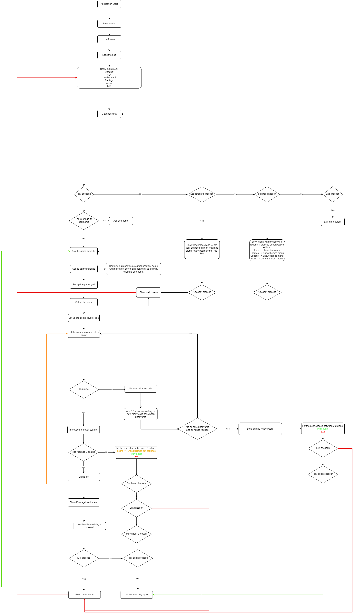

# Minesweeper

Welcome to Minesweeper, a console-based game.

## About

This game was coded by Matteo Ciocci as a school project. It is based on the Lanterna Google Library version 3.1.1.

### Data Collection Warning

By playing this game, you agree that your game data, including:
- username
- score
- game time

may be sent to the leaderboard for competition purposes.
Your privacy is important for us, and your data will be handled securely.

### How to Navigate Menus

- Use the arrow keys to move up and down.
- Press the Enter key to choose an option.
- To exit a menu, press Escape.

### How to Play

- Navigate the grid with the 4 arrow keys.
- Press Enter to uncover a cell.
- Press "F" to flag a cell.
- To win you need to flag all mines correctly.

If you uncover a mine you can respawn up to 3 times if you have enough score.

## Repository

The game repository can be found [here](https://github.com/elfoteo/Minesweeper).

## Backend

The game backend, where data gets sent to, can be found [here](https://github.com/elfoteo/MinesweeperBackend).

## Playing the Game

To play the game, you need to launch the `compile.py` script found in the main directory. Make sure you have Python and Java installed, with Python 3 and Java 19 being the recommended versions.

## Diagrams

### Activity Diagram

### Class Diagram

